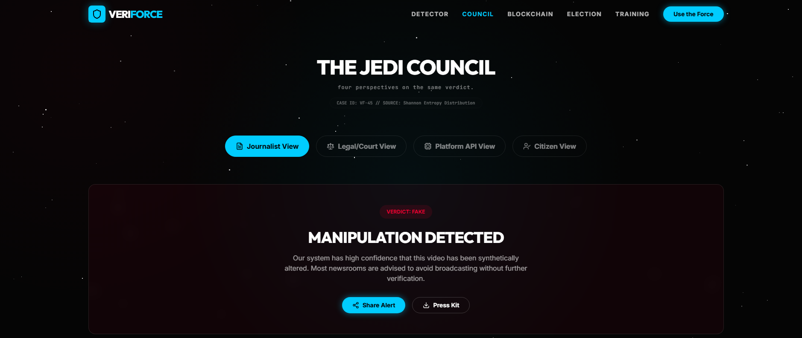
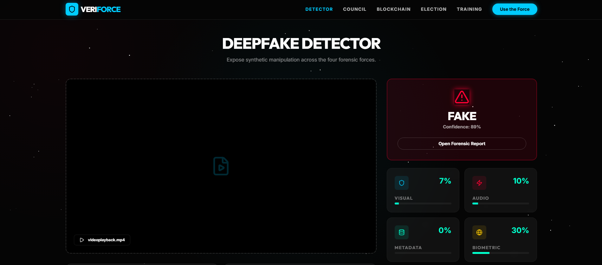

<div align="center">
  

  # 🛡️ VeriForce
  
  *Protecting democracy and human connection in the age of synthetic media through multi-modal deepfake detection.*

  <br />

  
  
  
  
  

</div>

<br />

## 📸 Platform Glimpse

| **Jedi Council Dashboard** | **Biometric Pulse Detection** |
| :---: | :---: |
|  |  |

---

## 🏗️ The MLE Architecture: The Four Forces

VeriForce utilizes a highly advanced ensemble engine that combines multiple layers of detection to catch deepfakes that single-model systems miss:

1. 👁️ **Visual Force (35%)**: Artifact and face-swap detection using latent anomalies.
2. 🎙️ **Audio Force (30%)**: Voice cloning and synthetic breath pattern mapping.
3. 💾 **Metadata Force (15%)**: File origin tracking and compression artifact history.
4. ❤️ **Biometric Force (20%)**: Remote Photoplethysmography (rPPG) measuring synthetic blood flow.

---

## ✨ Unique Features
- ⚖️ **Jedi Council Views**: Highly specialized analytics dashboards built specifically for Journalists, Lawyers, Citizens, and Platforms. 
- 🏛️ **Election Guardian**: Real-time political deepfake monitoring tailored for the Indian electorate.
- 🔗 **Blockchain Guardian**: Tamper-proof, immutable content authentication deployed via Polygon.
- 🎮 **Gamified Training**: Educating the public on how to spot the 'Force' (fake media).

---

## 🚀 Quick Start (Local Development)

### Prerequisites
- Python 3.11+
- Node.js 20+
- Redis (Required for async background processing of large videos)

### 1. Backend Setup (Django API + ML)
```bash
cd backend
pip install -r requirements.txt
python manage.py migrate
python manage.py loaddata fixtures/sample_data.json
python manage.py runserver
```

### 2. Celery Workers (Video Processing)
*In a separate terminal, start the worker to handle the intensive ML jobs.*
```bash
cd backend
celery -A config worker --loglevel=info
```

### 3. Frontend Setup (React App)
```bash
cd frontend
npm install
npm run dev
```

---

## 🛠️ Full Tech Stack
- **Frontend**: React 18, TypeScript, Vite, TailwindCSS, Framer Motion, Recharts.
- **Backend**: Django, Django REST Framework, PostgreSQL.
- **Machine Learning**: PyTorch, Transformers, ONNX Runtime, OpenCV, Librosa.
- **Infrastructure & Async**: Celery, Redis, Docker Compose.

---
<div align="center">
  <i>May the Force be with our code.</i>
</div>
